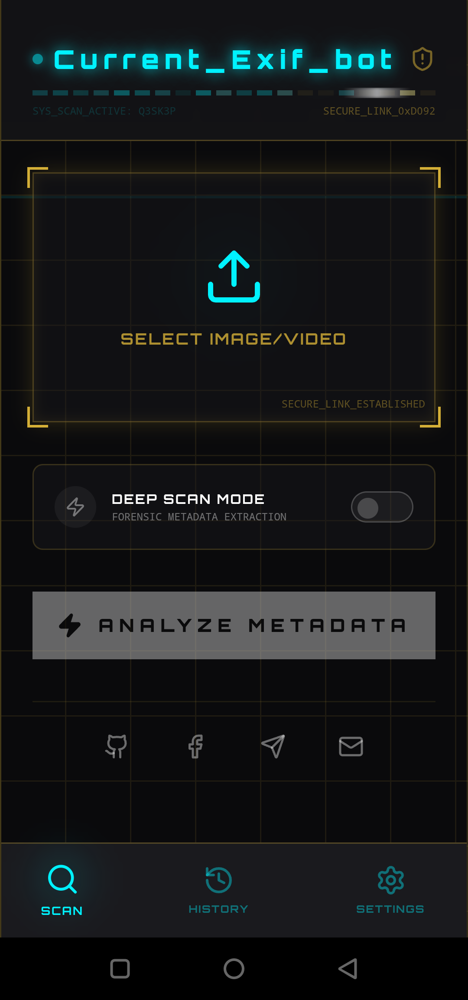
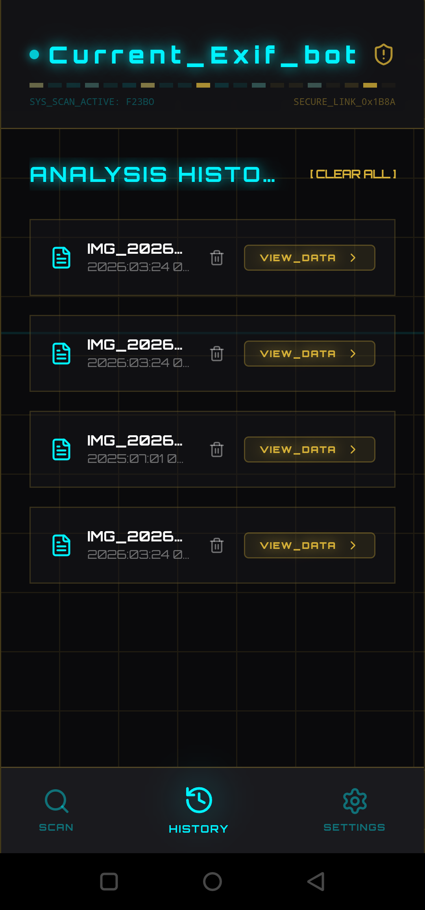
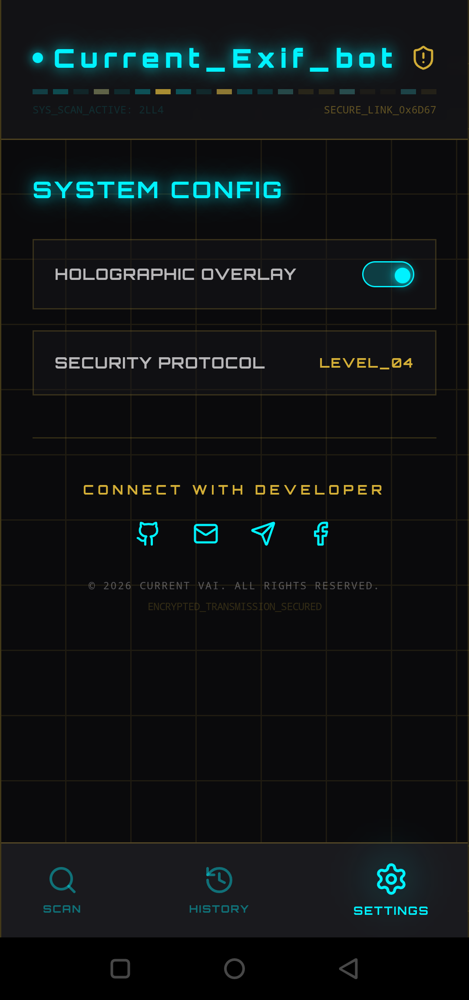

# 🧠 Current_Exif_Bot

  

  

  
  
  

  🚀 Extract hidden EXIF metadata, GPS location & camera details instantly

---

## 📥 Download APK

  

---

  ⚡ Fast • Secure • No Ads

---

## ✨ Features

- 📷 Camera Specs & EXIF Info  
- 📍 Live GPS Location Tracking  
- 🔐 Privacy Protection Mode  
- ⚡ Instant Metadata Analysis  

---

## 🖼️ App Screenshots

  
  
  

---

## 🧠 How It Works

1. Upload Image 📤  
2. Scan Metadata 🔍  
3. View EXIF + GPS 📍  
4. Analyze Details ⚡  

---

## 🚀 Version

- v1.0-beta (Pre-release)

---

## 👨‍💻 Developer

**Current Vai**  
📧 currentvai@gmail.com  

---

## 🌐 Connect

  

---

## ⭐ Support

If you like this project, give it a star ⭐  

---

## ⚠️ Disclaimer

This tool is for educational and personal use only.  
Use responsibly and respect privacy.
